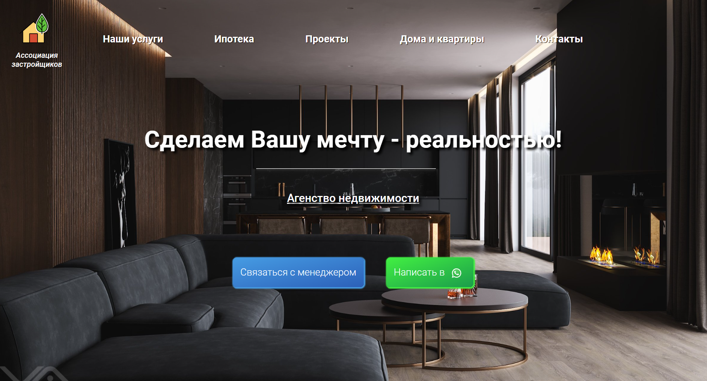
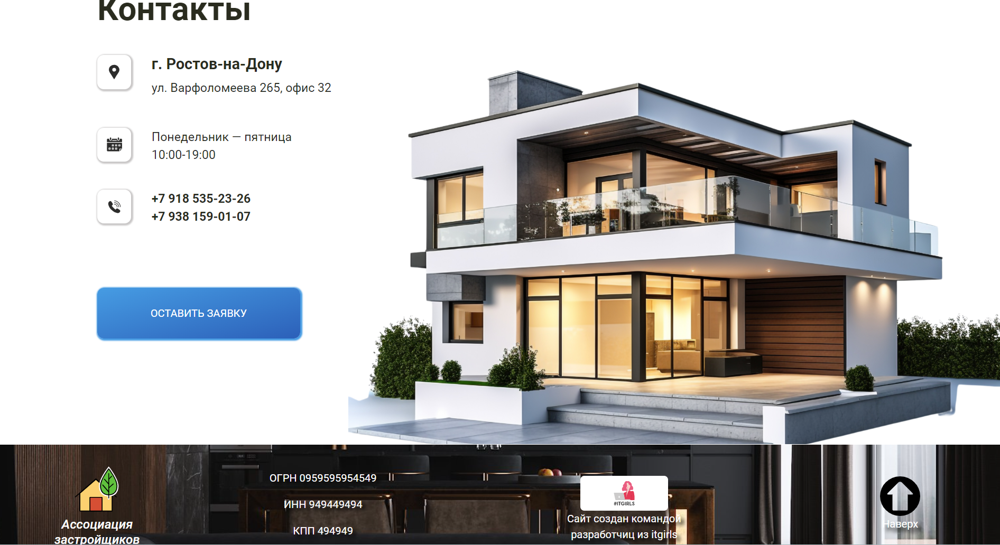
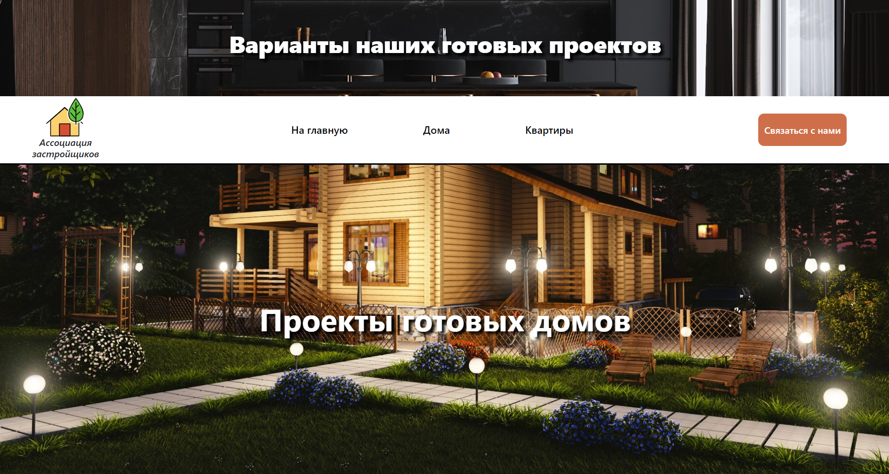

# Командный проект №2.
# Сайт для агенства недвижимости "Ассоциация застройщиков"
Данный проект наша команда выполняла по заказу реального человека, представляющего одну из компаний, осуществляющих сделки с недвижимостью на юге России.

 

"Ассоциация застройщиков" - агенство недвижимости со штаб-квартирой в г. Ростов-на-Дону, специализурующееся на строительстве и продаже домов, а также на продаже квартир под ключ в Южном и Центральном ФО России.

### Сайт состоит из 2 страниц: основной, включающей в себя 4 информационных блока (Услуги компании, преимущества компании, проекты, контакты), и дополнительной - отдельной страницы по готовым проектам агенства.

 

### Проект выполнен с использованием графического редактора Figma
### и реализован на базе технологий `html5`, `css3` и фреймворка `bootstrap5`

 

### Архитектура проекта создана на основе препроцессора Sass.

    

### Сайт кроссбраузерный (корректно открывается через Google Chrome, Microsoft Edge, Opera, Safari) 
### Сайт адаптирован под разные виды устройств (desktop, tablet, mobile):

#### Основная страница:

 

#### Дополнительная страница:

### Код оснащен необходимыми для понимания структуры проекта комментариями.

### На сайте реализована форма обратной связи по просьбе заказчика.

### Команда разработчиков проекта:
* MariaLukyanova
* AlenaGorina
* NadezhdaKov
* Basulka
* Helen1553

#### <u>**Памятка по работе с GIT**</u>
* <i>Клонирование репозитория:</i>
  1. Переходим в нужный репозиторий и нажимаем на кнопку "<>Code"
  2. Копируем ссылку
  3. Создаём папку для проекта на рабочем столе
  4. В этой папке в адресной строке пишем `cmd` - появляется терминал
  5. В терминале набираем команду `git clone "ссылка на репозиторий" .`
  6. Далее работаем с этой папкой уже в vscode

 

<b> Пошаговый алгоритм работы в ветках:
1. Создаём свою ветку: `git checkout -b имя вашей (пока еще не существующей) ветки` (после этого вы сразу перемещаетесь в неё);
2. Работаем в своей ветке, заливаем её на гитхаб (т.е. пушим из неё в неё же; + не забываем периодически подтягивать изменения из main)
3. Когда вы выполнили свою задачу в своей ветке - вам нужно влить её в main (до этого переходим в main --> подтягиваем все изменения из гх сначала туда --> переходим в свою ветку - и объединяем свой контент с контентом main (не забываем до это зафиксировать изменения и закоммитить) --> `git merge main` --> решаем конфликты (если будут) --> пушим на гх в свою ветку);
4. На гх - открываем вкладку `Pull requests` --> создаём пулл-реквест на свою ветку, которая должна влиться в main - и пишите об этом в чат;
5. Техлид принимает ваш пулл-реквест и пишет об этом в чат, чтобы все в команде знали, что main изменился и нужно его подтянуть к себе;
6. ВСЕ подтягивают себе изменения с гитхаба (сначала проверяем ветку main --> подтягиваем изменения в main c гх `git pull` --> далее подтягиваем изменения из main к себе в ветку  `git merge main` или, если через интерфейс: через 3 точки --> `Push,Pull` --> `Pull from main` ) !
7. как подтянули все нужные изменения из main - запушьте это в свою ветку - чтобы на гитхабе ваша ветка не отставала от main<b>
